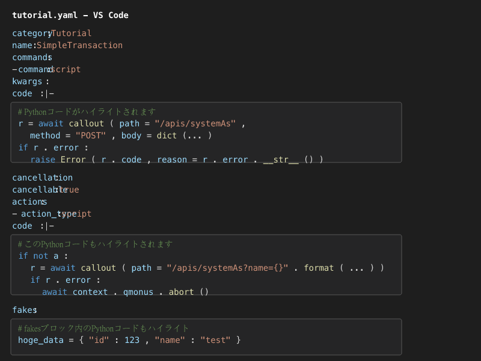

# Qmonus YAML Highlighter

QmonusのYAMLファイル内に埋め込まれたPythonコードブロックに対するシンタックスハイライト機能を提供する拡張機能です。

## 機能

この拡張機能は以下の機能を提供します：

- QmonusのYAMLファイル内に埋め込まれたPythonコードブロックを自動的に検出
- 検出されたPythonコードに対して適切なシンタックスハイライトを適用
- 以下のパターンに対応:
  - `code: |-` の後に続くPythonコードブロック
  - `action_type: script` の後の `code: |-` で始まるPythonコードブロック
  - `script: |-` の後に続くPythonコードブロック
  - `fakes:` の後に続くPythonコードブロック
  - `output: |-`, `cleanup: |-`, `end: |-`, `body: |-` の後に続くPythonコードブロック
  - `category:` の値に関わらず、`name:` の後に続く `fakes:` ブロック

例：



## 使い方

この拡張機能をインストールすると、`.yaml`および`.yml`ファイル内のQmonus形式のコードブロックが自動的にハイライトされます。

特定のファイルを`.qmonus.yaml`または`.qmonus.yml`として保存すると、専用のファイルタイプとして認識されます。

## サポートしているパターン

以下のYAMLパターン内のPythonコードが認識されます：

```yaml
# パターン1: code: |- の後にPythonコードが続く場合
commands:
  - command: script
    kwargs:
      code: |-
        # ここのPythonコードがハイライトされます
        result = some_function()
        if result.error:
            raise Error(result.code)
```

```yaml
# パターン2: action_type: script の後のcode: |- ブロック
cancellation:
  actions:
    - action_type: script
      code: |-
        # ここのPythonコードもハイライトされます
        await context.abort()
```

```yaml
# パターン3: script: |- の後のPythonコードブロック
hooks:
  pre_process:
    script: |-
      # ここのPythonコードもハイライトされます
      data = prepare_data(input_value)
      return data
```

```yaml
# パターン4: fakes: の後のPythonコードブロック
category: Tutorial
name: getHoge
fakes:
  # このPythonコードがハイライトされます
  hoge_data = {"id": 123, "name": "test"}
  return hoge_data
```

```yaml
# パターン5: output: |- の後のPythonコードブロック
scenarios:
  - name: get_data
    output: |-
      # ここのPythonコードもハイライトされます
      return {"status": "success", "data": result}
```

```yaml
# パターン6: cleanup: |- などの後のPythonコードブロック
tests:
  cleanup: |-
    # テスト終了時のクリーンアップコードもハイライトされます
    await db.delete_all_test_data()
```

## パッケージ化と配布方法

チーム内で拡張機能を共有するには、以下の手順でVSIXパッケージを作成できます。

### 開発環境の準備

拡張機能のパッケージ化には VS Code Extension Manager (vsce) が必要です：

```bash
npm install -g vsce
```

### VSIXパッケージの作成

プロジェクトのルートディレクトリで以下のコマンドを実行します：

```bash
cd /path/to/qmonus-yaml
vsce package
```

成功すると、`qmonus-yaml-[version].vsix` という名前のファイルが生成されます（例：`qmonus-yaml-0.0.2.vsix`）。このファイルがインストール可能な拡張機能パッケージです。

## インストール方法

### 方法1：コマンドラインからのインストール

```bash
code --install-extension qmonus-yaml-0.0.2.vsix
```

### 方法2：VS Codeの拡張機能メニューからインストール

1. VS Codeを開く
2. アクティビティバーの拡張機能アイコン（または `Ctrl+Shift+X`）をクリック
3. 拡張機能ビューの右上にある「...」（その他のアクション）メニューをクリック
4. 「VSIXからのインストール...」を選択
5. 作成したVSIXファイルを選択してインストール

### インストール確認

インストール後、以下のいずれかの方法で拡張機能が正しくインストールされたか確認できます：

- VS Codeの拡張機能ビューで「@installed qmonus」と検索
- `.yaml`ファイルを開き、埋め込まれたPythonコードのハイライトを確認

## チーム内での共有

作成したVSIXファイルは以下の方法でチームメンバーと共有できます：

- チームの共有フォルダやドライブにアップロード
- 社内GitHubリポジトリに添付ファイルとして配置
- チャットツール（SlackやTeamsなど）でファイル共有

## 要件

- Visual Studio Code 1.60.0以上

## 既知の問題

現在、特に既知の問題はありません。問題を発見した場合は、GitHubリポジトリにIssueを作成してください。
